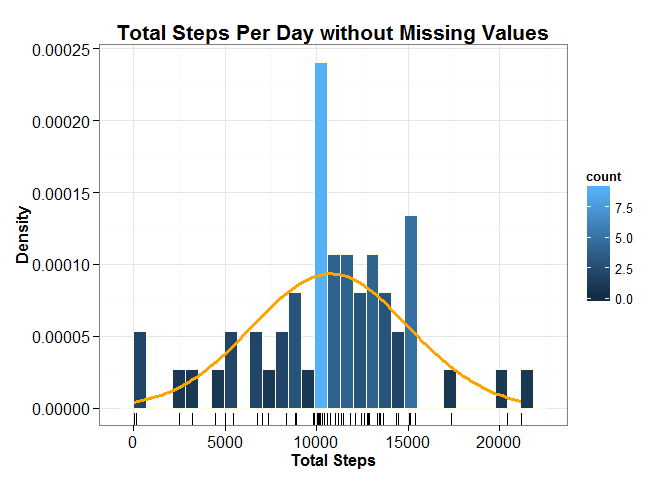
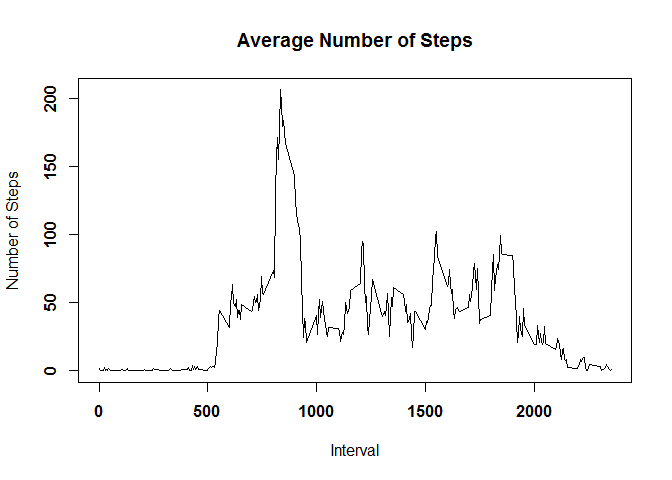
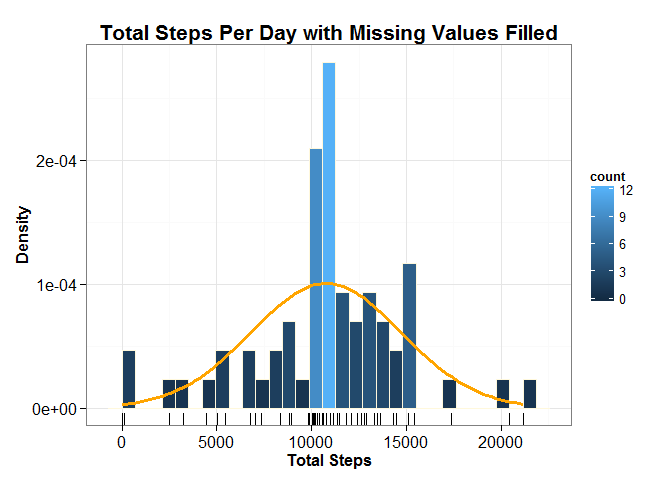
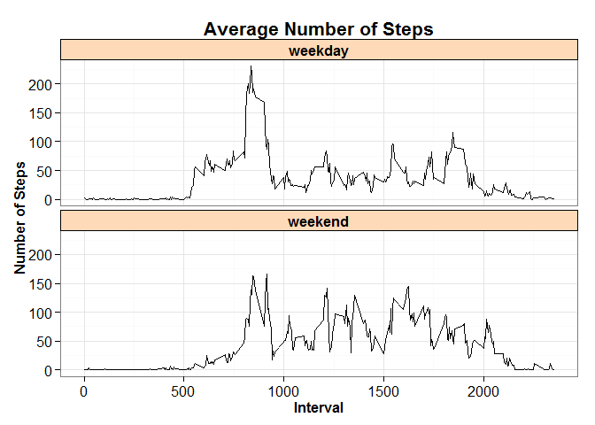

Peer Assessment 1
=================

### Part 1: Loading and Preprocessing the Data


```r
library(lubridate)
library(dplyr, warn.conflicts = FALSE)
library(ggplot2)

# 1. Read data file 
# 2  Create a data frame
# 3. Coerce "date" column to as.Date
# 4. Remove missing values "NA"

f <- "./data/activity.csv"
data <- read.csv(f, header=TRUE, sep = "," , stringsAsFactors=FALSE)
data <- tbl_df(data)
data$date <- as.Date(data$date, "%Y-%m-%d")
data <- data[complete.cases(data),] 
```


### Part 2: What is Mean Total Number of Steps Taken per Day?

**2.1 Total Number of Steps Taken per Day**

In this step, data is grouped by "date"" and sum is applied to "steps" column to calculate sum for each day


```r
# Group data by "date"" and calculate sum for the "steps" column  for each day
Total_Steps <- data %>% group_by(date) %>% summarise(total = sum(steps))
```

An output of 10 lines for the "Total_Steps"" data frame is below:


```r
print(Total_Steps)
```

```
## Source: local data frame [53 x 2]
## 
##          date total
## 1  2012-10-02   126
## 2  2012-10-03 11352
## 3  2012-10-04 12116
## 4  2012-10-05 13294
## 5  2012-10-06 15420
## 6  2012-10-07 11015
## 7  2012-10-09 12811
## 8  2012-10-10  9900
## 9  2012-10-11 10304
## 10 2012-10-12 17382
## ..        ...   ...
```

**2.2 Histogram of the Total Number of Steps Taken each Day**

Below is a histogram of the total number of steps taken each day


```r
# Plot a histogram of the total number of steps taken each day
plot <- ggplot(Total_Steps, aes(total)) + 
  geom_histogram(aes(y = ..density.., fill = ..count..), colour="#FFF8DC", size=.2) +
  stat_function(fun = dnorm, size =1.3, colour = "orange", args = list(mean = mean(Total_Steps$total), sd = sd(Total_Steps$total))) +
  theme_bw() +
  geom_rug() +
  labs(title = "Total Steps Per Day without Missing Values",
     x = "Total Steps", y = "Density") +
  theme(plot.title = element_text(face="bold", size = rel(1.3))) +
  theme(axis.title.x = element_text(face="bold"), axis.text.x  = element_text(vjust=0.5, size=12),
        axis.title.y = element_text(face="bold"), axis.text.y  = element_text( vjust=0.5, size=12))
print(plot)
```

 


**2.3 The Mean and Median of the Total Number of Steps Taken per Day**


```r
# Calculate the mean and median of the total number of steps taken per day
summary1 <- Total_Steps %>% summarise(Mean = mean(total), Median = median(total))
print(summary1)
```

```
## Source: local data frame [1 x 2]
## 
##       Mean Median
## 1 10766.19  10765
```

The **mean** and **median** of the total number of steps taken per day are **10766** and **10765** respectively

### Part 3: What is the Average Daily Activity Pattern?

**3.1 Average Number of Steps Taken**

Below is a plot for the 5-minute interval and the average number of steps taken, averaged across all days


```r
# Group data by interval and calculate the average number of steps takes
Daily_Activity <- data %>% group_by(interval) %>% summarise(average = mean(steps))

# Plot the 5-minute interval and the average number of steps taken, avergaed across all days
par(font.lab = 1, font.axis = 2)               
with(Daily_Activity, plot(interval, average, type="l", xlab = "Interval", ylab = "Number of Steps")) 
title("Average Number of Steps")
```

 

**3.2 The 5-minutes Interval with Maximum Number of Steps**


```r
# Identify which 5-minute interval contains the maximum bumber of steps
# 1. Determine the maximum for average number of steps
# 2. Coerce "average" columns and "Max_Ave_Step" as.double
# 3. Identify the row containing the "Max_Ave_Step"

Max_Ave_Step <- Daily_Activity %>% summarise(max = max(average))
Daily_Activity$average <- as.double(Daily_Activity$average)
Max_Ave_Step <- as.double(Max_Ave_Step)
Interval_Max_Ave_Step <- Daily_Activity[Daily_Activity$average == Max_Ave_Step,]
```

The **835**th 5-minute interval across all days contains the **maximum** number of of steps, which is  **206.17**

### Part 4: Imputing Missing Values

Read the dataset but without removing missing values "NA"


```r
# 1. Read dataset
# 2  Create a data frame
# 3. Coerce "date" column to as.Date

f <- "./data/activity.csv"
data <- read.csv(f, header=TRUE, sep = "," , stringsAsFactors=FALSE)
data <- tbl_df(data)
data$date <- as.Date(data$date, "%Y-%m-%d")
```

**4.1 Calculate Total Number of Missing Values in the Dataset** 


```r
Count <-sum(is.na(data))
```

The total number of missing values in the dataset is **2304**

**4.2 Fill in all of the Missing Values in the Dataset**

The strategy taken to fill missing values is to replace missing values with the mean for the 5-minute interval. Below are steps:

1. Join "Daily_Activity" data frame (from section 3.1 above), which contains mean of 5-minutes interval, with "data" data frame (from section 4 above), which contains NA.  The key for joining the two datasets is the "interval" column
2. For each row, evaluate element under "steps".  If the value is NA, replace it with the mean of 5-minutes interval from the "average" column. Otherwise leave the "steps" value unchanged
3. Create a a new dataset equal to the original dataset by removing "average" column


```r
new_dataset <- left_join(data, Daily_Activity, by ="interval")
new_dataset <- new_dataset %>% mutate(steps = ifelse(is.na(steps), round(average,2), steps))
```

**4.3 Create a New Dataset Equals to Original Dataset with Missing Data Filled in**

```r
new_dataset  <- select(new_dataset , -average)
```

An output of 10 lines for the "new_data dataset"" is below:


```r
print(new_dataset)
```

```
## Source: local data frame [17,568 x 3]
## 
##    steps       date interval
## 1   1.72 2012-10-01        0
## 2   0.34 2012-10-01        5
## 3   0.13 2012-10-01       10
## 4   0.15 2012-10-01       15
## 5   0.08 2012-10-01       20
## 6   2.09 2012-10-01       25
## 7   0.53 2012-10-01       30
## 8   0.87 2012-10-01       35
## 9   0.00 2012-10-01       40
## 10  1.47 2012-10-01       45
## ..   ...        ...      ...
```

**4.4 Histogram of the Total Number of Steps Taken each Day**

Below is a histogram of the total number of steps taken each day


```r
# Using the new dataset, group dataset by "date"" and calculate sum for the "steps" column  for each day

Total_Steps <- new_dataset %>% group_by(date) %>% summarise(total = sum(steps))

# Plot a histogram of the total number of steps taken each day
plot <- ggplot(Total_Steps, aes(total)) + 
  geom_histogram(aes(y = ..density.., fill = ..count..), colour="#FFF8DC", size=.2) +
  stat_function(fun = dnorm, size =1.3, colour = "orange", args = list(mean = mean(Total_Steps$total), sd = sd(Total_Steps$total))) +
  theme_bw() +
  geom_rug() +
  labs(title = "Total Steps Per Day with Missing Values Filled",
       x = "Total Steps", y = "Density") +
  theme(plot.title = element_text(face="bold", size = rel(1.3))) +
  theme(axis.title.x = element_text(face="bold"), axis.text.x  = element_text(vjust=0.5, size=12),
        axis.title.y = element_text(face="bold"), axis.text.y  = element_text( vjust=0.5, size=12))
print(plot)
```

 

```r
# Calculate the mean and median of the total number of steps taken per day
summary2 <- Total_Steps %>% summarise(Mean = mean(total), Median = median(total))
print(summary2)
```

```
## Source: local data frame [1 x 2]
## 
##       Mean   Median
## 1 10766.18 10766.13
```

The **mean** and **median** of the total number of steps taken per day, with missing valued filled, are **10766** and **10766** respectively

Summary:

1. The **mean** without and with missing values are:   **10766** vs.  **10766** respectively
2. The **median** without and with missing values are:  **10765** vs.   **10766** respectively

<u>In summary, the impact of imputing missing values is that, **the mean is the same but the median is slightly different**.</u>

### Part 5: Are there Differences in Activity Patterns between Weekdays and Weekends?

**5.1 Create a New Factor Variable with Two Levels; "weekday" and "weekend"** 


```r
weekdays <- c('Monday', 'Tuesday', 'Wednesday', 'Thursday', 'Friday')
new_dataset$DayType <- factor((weekdays(new_dataset$date) %in% weekdays)+1L, levels=1:2, labels=c('weekend', 'weekday'))
```
An output of 10 lines for the "new_data dataset"" is below:


```r
print(new_dataset)
```

```
## Source: local data frame [17,568 x 4]
## 
##    steps       date interval DayType
## 1   1.72 2012-10-01        0 weekday
## 2   0.34 2012-10-01        5 weekday
## 3   0.13 2012-10-01       10 weekday
## 4   0.15 2012-10-01       15 weekday
## 5   0.08 2012-10-01       20 weekday
## 6   2.09 2012-10-01       25 weekday
## 7   0.53 2012-10-01       30 weekday
## 8   0.87 2012-10-01       35 weekday
## 9   0.00 2012-10-01       40 weekday
## 10  1.47 2012-10-01       45 weekday
## ..   ...        ...      ...     ...
```

**5.2 Plot 5-minute Interval and the Average Number of Steps Taken**

The following steps are takes:

1. Create two datasets filtered by "DayType"; weekday and weekend datasets
2. For each dataset, group data by interval and calculate the average number of steps takes
3. Row-bind both datasets; weekday and weekend  datasets
3. Make a panel plot of the 5-minute interval and the average number of steps taken for each dataset


```r
# Createw eekday and weekend datasets
weekdays <- new_dataset[new_dataset$DayType == "weekday",]
weekend <- new_dataset[new_dataset$DayType == "weekend",]

# For each dataset, group data by interval and calculate the average number of steps takes
Daily_Activity_Weekday <- weekdays %>% group_by(interval) %>% summarise(average = mean(steps)) %>% mutate(DayType = "weekday")
Daily_Activity_Weekend <- weekend %>% group_by(interval) %>% summarise(average = mean(steps)) %>% mutate(DayType = "weekend")

# Row-bind both weekday and weekend datasets
Daily_Activity <- bind_rows(Daily_Activity_Weekday, Daily_Activity_Weekend)

# Make a panel plot the 5-minute interval and the average number of steps
ggplot(Daily_Activity, aes(x = interval, y = average)) +
  geom_line(colour="black", linetype="solid", size=0.5) +
  facet_wrap(~ DayType, nrow=2) +
  theme_bw() +
  labs(title = "Average Number of Steps",
       x = "Interval", y = "Number of Steps") +
  theme(plot.title = element_text(face="bold", size = rel(1.3))) +
  theme(axis.title.x = element_text(face="bold"), axis.text.x  = element_text(vjust=0.5, size=12),
        axis.title.y = element_text(face="bold"), axis.text.y  = element_text( vjust=0.5, size=12),
        strip.text.x = element_text(size=12, face="bold"),
        strip.background = element_rect(colour="black", fill="#FFDAB9"))
```

 
